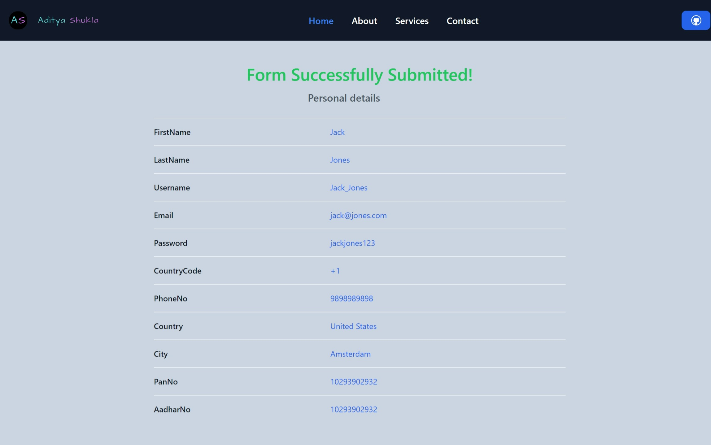

<div align="center">
<h3 align="center">Form Validation</h3>
      
      
  <br />

  <!-- <div>
    
  </div> -->
</div>

## 📋 <a name="table">Table of Contents</a>

1. 🤖 [Introduction](#introduction)
2. ⚙️ [Tech Stack](#tech-stack)
3. 🔋 [Features](#features)
4. 🤸 [Quick Start](#quick-start)
5. 🕸️ [Snippets](#snippets)

## <a name="introduction">🤖 Introduction</a>

This project is a simple React application built with Vite and styled using TailwindCSS. It features a form that validates required fields.

Used `vite` as Vite offers faster build times compared to Create-React-App due to its pre-bundling and efficient hot module replacement 

## <a name="tech-stack">⚙️ Tech Stack</a>

- React.js
- Tailwind


## <a name="features">🌟 Features</a>

👉 **Form Validation**: Ensures all required fields are filled correctly.

👉 **Error Messages**: Displays user-friendly error messages for invalid inputs.

👉 **Dynamic Form Controls**: Password show/hide toggle, country and city dropdowns.

👉 **Post-Submission**: Redirects to a new route displaying the entered details upon successful form submission.

## <a name="quick-start">🤸 Quick Start</a>

**Prerequisites**

Follow these steps to set up the project locally on your machine.

Make sure you have the following installed on your machine:

- Git
- Node.js
- npm (Node Package Manager)

**Cloning the Repository**

```bash
git clone https://github.com/Aditya10403/React-Form-Validation.git
cd React-Form-Validation
```

**Running the Project**

Install dependencies
```bash
npm install # or npm i
```

Start the server:
```bash
npm run dev
```

- Open your browser and navigate to `http://localhost:3000`.

**How to Use**

👉 **Fill out the form**: Complete all required fields.

👉 **Submit the form**: Click the submit button. If there are any validation errors, they will be displayed.

👉 **Successful submission**: Upon successful form submission, you will be redirected to a new page displaying the entered details.

## <a name="snippets">🕸️ Snippets</a>

<details>
<summary><code>vite.config.js</code></summary>

```javascript
import { defineConfig } from "vite";
import react from "@vitejs/plugin-react";

// https://vitejs.dev/config/
export default defineConfig({
  plugins: [
    react(),
  ],
  resolve: {
    alias: {
      "@mui/styled-engine": "@mui/styled-engine-sc",
    },
  },
});

```

</details>

<details>
<summary><code>tailwind.config.js</code></summary>

```javascript
/** @type {import('tailwindcss').Config} */
export default {
  content: [
    "./index.html",
    "./src/**/*.{js,ts,jsx,tsx}",
  ],
  theme: {
    extend: {
      // Hide the default eye icon for password input fields
      '@media (prefers-reduced-motion: no-preference)': {
        'input::-webkit-outer-spin-button': {
          '-webkit-appearance': 'none',
          margin: 0,
        },
        'input::-webkit-inner-spin-button': {
          '-webkit-appearance': 'none',
          margin: 0,
        },
        'input[type=number]': {
          '-moz-appearance': 'textfield',
        },
      },
    },
  },
  plugins: [],
}
```

</details>


## <a>🚨 Disclaimer</a>

The form validation implemented here is intended for educational purposes only.

#

